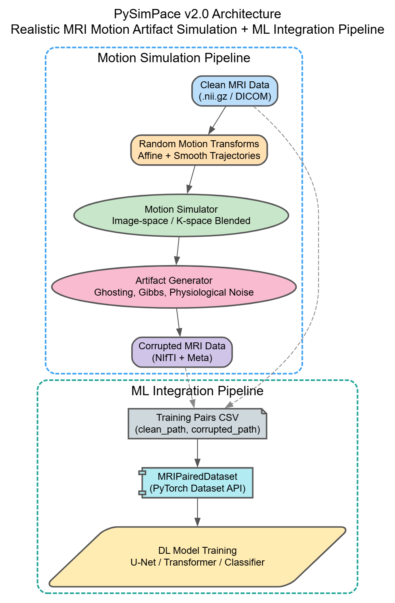

# PySimPace

**PySimPace v2.0.1**  
**Realistic MRI Motion Artifact Simulation Toolkit**  
*(Structural MRI & fMRI Support, Deep Learning Integration Ready)*

Author: Snehil Kumar  
Contact: sk895@exeter.ac.uk  
License: MIT License

---

## Overview

PySimPace is an open-source Python library for simulating realistic **motion artifacts** and **image artifacts** in MRI data, including both **structural MRI (3D)** and **fMRI (4D)**.

It is designed to:

✅ Provide realistic motion simulation for training deep learning models  
✅ Support both structural MRI and fMRI pipelines  
✅ Support realistic artifact generation (ghosting, Gibbs ringing, physiological noise)  
✅ Provide a simple API + CLI + tutorials  
✅ Provide paired datasets for supervised training of motion correction models  
✅ Be fast and scalable (supports parallelism)  
✅ Be fully open and extensible

---


### PySimPace ML Pipeline Architecture



The architecture of the PySimPace ML pipeline is as follows:

- Clean MRI images are loaded.
- For each sample, a new random motion + artifact configuration is generated.
- The motion simulator applies image-space or k-space blended motion.
- Artifacts are applied (ghosting, Gibbs, physio noise).
- The clean-corrupted pairs are saved.
- The resulting dataset is loaded via MRIPairedDataset into PyTorch training pipelines.

This architecture allows generating large-scale, highly diverse training data for motion correction deep learning models.


## What's New in v2.0.1

✅ Modular architecture (TensorFlow-style)  
✅ Image-space motion simulation (slice-wise)  
✅ Blended k-space motion simulation (realistic, new contribution)  
✅ Ghosting artifact simulation  
✅ Gibbs ringing artifact simulation  
✅ Full fMRI motion simulation with intra-volume motion + physiological noise  
✅ ML integration (`ml.py`) → generate training pairs → ready for PyTorch  
✅ Full tutorials in Jupyter format  
✅ Unit test scaffolding (`tests/`)  
✅ CLI planned  

---

## Motion & Artifact Support (v2.0)

### Motion types supported:
- Image-space motion (slice-wise motion blocks)
- K-space motion:
  - Basic k-space motion (combination method)
  - Blended k-space motion (realistic smooth motion) ✅ main contribution

### Artifact types supported:
- Ghosting (phase-encoding ghosting, in blended k-space motion)
- Gibbs ringing
- Physiological noise (fMRI only)

### Planned for v2.1:
- Spike noise
- Intensity drift
- Susceptibility distortions
- Partial Fourier artifacts

---

## Installation

### Local installation

```bash
git clone https://github.com/snehil03july/py-SimPace.git
cd py-SimPace
pip install -e .
```

### From PyPI (coming soon)

```bash
pip install py-simpace
```

---

## Project Structure

```
pysimpace/
├── __init__.py
├── simulation/
│   ├── structural.py
│   ├── functional.py
│   ├── transforms.py
│   ├── noise.py
│   ├── models.py
├── io.py
├── analysis.py
├── ml.py
├── cli.py
├── gui.py
├── utils.py
docs/
examples/
├── structural_simulation_tutorial.ipynb
├── fmri_simulation_tutorial.ipynb
├── ml_integration_tutorial.ipynb
tests/
Dockerfile
setup.py / pyproject.toml
requirements.txt
README.md
LICENSE
```

## 🚀 Running with Docker

We provide a ready-to-use Docker container for testing and running `py-simpace` without any local installation.

### 🐳 Build the Docker Image

Clone the repository and run:

```bash
docker build -t pysimpace .
```

This will:

- Install `py-simpace` in editable mode
- Include all examples and CLI tools
- Set up a Python 3.10 environment

---

### ▶️ Run the Container

Launch an interactive shell inside the container:

```bash
docker run -it pysimpace
```

Once inside, you can run any example, such as:

```bash
python examples/demo_motion_simulation.py
```

---

### 📁 Access Output Files

To save output files (e.g., corrupted NIfTI images) to your local machine, mount a volume:

```bash
docker run -it -v $(pwd)/outputs:/app/outputs pysimpace
```

This will write output files to the `outputs/` folder in your local directory.

---

### 📦 Notes

- By default, the container uses CPU. No GPU is required.
- All required dependencies are pre-installed.
- For advanced usage (e.g., PyTorch training), use the `MRIPairedDataset` class as described in the documentation.


---

## Quick Usage

### Structural MRI motion simulation

```python
from pysimpace.io import load_nifti, save_nifti
from pysimpace.simulation.structural import simulate_structural_motion
from pysimpace.simulation.models import generate_random_affine_transforms

# Load clean MRI
clean_data, affine, header = load_nifti("clean_image.nii.gz")

# Generate random transforms
transforms = generate_random_affine_transforms(5, 5.0, 5.0, clean_data.shape)

# Simulate motion
corrupted_data = simulate_structural_motion(
    clean_data,
    transforms=transforms,
    use_blended=True,
    ghosting=True,
    apply_gibbs=True,
    gibbs_strength=0.05,
    seed=42
)

# Save corrupted image
save_nifti(corrupted_data, affine, header, "corrupted_image.nii.gz")
```

---

### fMRI motion simulation

```python
from pysimpace.io import load_nifti, save_nifti
from pysimpace.simulation.functional import simulate_fmri_motion
from pysimpace.simulation.models import MotionTrajectory, generate_smooth_motion_trajectory

# Load clean fMRI
fmri_data, affine, header = load_nifti("clean_fmri.nii.gz")

# Generate trajectory
n_vols = fmri_data.shape[-1]
n_slices = fmri_data.shape[2]
trajectory = MotionTrajectory(n_volumes=n_vols, n_slices=n_slices)

vol_transforms = generate_smooth_motion_trajectory(
    n_volumes=n_vols, target_fd_mm=0.5, vol_shape=fmri_data.shape[:3], smoothing_sigma=3.0, seed=42
)

for t in range(n_vols):
    trajectory.set_volume_transform(t, vol_transforms[t])

# Simulate motion
corrupted_fmri = simulate_fmri_motion(
    fmri_data,
    trajectory,
    intra=True,
    physio=True,
    parallel=True,
    seed=42
)

# Save corrupted fMRI
save_nifti(corrupted_fmri, affine, header, "corrupted_fmri.nii.gz")
```

---

## ML Integration

### Generate paired training data

```python
from pysimpace.ml import generate_training_pairs

generate_training_pairs(
    clean_dir="examples/clean",
    output_dir="examples/training_pairs",
    n_samples=50,
    artifact_configs=None,
    structural=True,
    use_blended=True,
    save_format='nifti',
    seed=42
)
```

### Load paired dataset in PyTorch

```python
from pysimpace.ml import MRIPairedDataset

dataset = MRIPairedDataset("examples/training_pairs/pairs.csv")
clean_img, corrupted_img = dataset[0]

# Example shape: (1, X, Y, Z)
```

---

## Tutorials

👉 Full examples provided in `examples/`:

✅ `structural_simulation_tutorial.ipynb`  
✅ `fmri_simulation_tutorial.ipynb`  
✅ `ml_integration_tutorial.ipynb`

---

## Tests

Unit tests provided in `tests/`:

```bash
pytest tests/
```

Test coverage:

- `test_pipeline.py`
- `test_ml.py`

---

## API Documentation

### pysimpace.simulation.structural

```python
simulate_structural_motion(...)
```

### pysimpace.simulation.functional

```python
simulate_fmri_motion(...)
```

### pysimpace.simulation.models

```python
generate_random_affine_transforms(...)
generate_smooth_motion_trajectory(...)
MotionTrajectory(...)
```

### pysimpace.simulation.noise

```python
apply_gibbs_ringing(...)
apply_spike_noise(...)  # Coming soon
apply_intensity_drift(...)  # Coming soon
generate_physio_noise(...)
```

### pysimpace.ml

```python
generate_training_pairs(...)
MRIPairedDataset(...)
```

---

### Controlling Artifacts

The following artifacts can be enabled and controlled in PySimPace:

- **Ghosting (Structural MRI)**:
    - Enable: `ghosting=True`
    - Current version uses default strength (configurable in future versions)

- **Gibbs ringing (Structural MRI)**:
    - Enable: `apply_gibbs=True`
    - Control strength: `gibbs_strength` parameter (float, e.g., 0.01 to 0.1)

- **Physiological noise (fMRI)**:
    - Enable: `physio=True`
    - Current version uses default physio noise model (configurable in future versions)

Each sample generated in `generate_training_pairs` will apply these artifacts according to the selected parameters, allowing you to generate highly diverse motion + artifact scenarios for training robust deep learning models.

---

## Contributing

Contributions welcome!

To contribute:

1. Fork the repo
2. Clone your fork
3. Create a new branch
4. Implement your feature or bug fix
5. Add unit tests in `tests/`
6. Ensure all tests pass (`pytest tests/`)
7. Submit a pull request

Please follow PEP8 + black formatting.

---

## Contact

Maintainer: **Snehil Kumar**  
Email: [sk895@exeter.ac.uk](mailto:sk895@exeter.ac.uk)

---

## License

MIT License.

---

## Citation

If you use this software in your research, please cite:

```text
Snehil Kumar et al., "PySimPace: Realistic MRI Motion Artifact Simulation Toolkit," 2025.
(Submitted to ACM conference)
```

---

Happy simulating! 🚀
